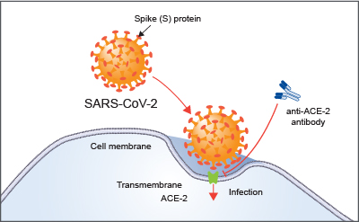

Escrit en anglès per Brooke Wolford i Kumar Veerapen traduït al català per Israel Fernández Cadenas i Jordi Pérez Tur

La pandèmia COVID-19 ha afectat la vida quotidiana de les societats de tot el món. Científics de tot el món treballen dur per entendre millor el virus i la malaltia. Representem un d’aquests grups, la COVID-19 Host Genetics Initiative (HGI), un equip internacional de genetistes centrat en la identificació de la variació genètica humana que influeix en les respostes a la infecció per SARS-CoV-2 i la seva malaltia posterior, COVID-19. Treballant junts, tenim curiositat per saber quines parts de l’ADN d’una persona poden influir en si algú desenvolupa COVID-19 i, si ho fa, quina gravetat tindrà la malaltia.

## El disseny de l'estudi COVID-19 HGI

Al nostre estudi, comparem la variació genètica entre casos, persones hospitalitzades i que també tenen una prova positiva de SARS-CoV-2, amb controls que són persones de la població general que no tenen una prova positiva de COVID-19. Aquesta comparació s’anomena estudi d’associació genòmica, o GWAS. Mireu aquest [vídeo](https://www.youtube.com/watch?v=cgyc55JhdcM) o [infografia](https://www.broadinstitute.org/visuals/explainer-genome-wide-association-studies) (tots dos en anglés) per obtenir una explicació il·lustrada de GWAS. A juliol de 2020, hem combinat els resultats de vuit estudis diferents per a un total de 3.199 casos i 897.488 controls.

<figcaption class="manual-md-inline-caption">
<strong>Figura 1: Resultats actuals a juliol de 2020.</strong>  Els resultats mostrats comparen dades genètiques entre 3.199 casos (pacients que van ser hospitalitzats per COVID-19) i 897.488 controls (mostres de la població que es presumeix que són COVID-19 negatives).
</figcaption>

## El COVID-19 HGI descobreix variacions genètiques associades a la gravetat del COVID-19

A la figura 1, es mostra un resum visual dels [resultats més recents](/results/) de la COVID-19 HGI. A este tipus de figures se’ls coneix com gràfiques Manhattan, consulteu la nota a peu de pàgina per obtenir una descripció completa d’aquesta visualització. En resum, s’utilitza una gràfica Manhattan per visualitzar associacions entre un tret (per exemple, COVID-19) i variants genètiques a tot el genoma. Observem una regió estadísticament significativa al cromosoma 3 (notem la línia vertical de punts sobre el cromosoma 3, tal com s’indica a l’eix x horitzontal, amb punts que sobrepassen la línea horitzontal roja que marca el nivell de significació estadística). De vegades, una regió inclou múltiples gens que estan a prop l’un de l’altre. Es necessitaran investigacions addicionals per reduir la regió estadísticament significativa al gen específic implicat en la gravetat del COVID-19. La regió identificada al cromosoma 3 es solapa amb diversos gens (vegeu tots els noms de gens que apareixen a la figura 2). No està clar quin gen específic d’aquesta estreta regió s’associa amb la gravetat del COVID-19. Tot i això, tenim algunes pistes interessants. Hi ha diversos gens relacionats amb quimiocines en aquesta regió, com ara CXCR6 i CCR1. Les quimiocines controlen el moviment de les cèl·lules immunes i són [fonamentals perquè el sistema immunitari innat funcioni correctament](https://www.ncbi.nlm.nih.gov/pmc/articles/PMC4448619/). El gen SLC6A20 també es troba en aquesta regió i produeix una proteïna que se sap que s’uneix a ACE2. La proteïna ACE2 és com una porta que el virus SARS-CoV-2 utilitza per entrar a les nostres cèl·lules (Figura 3). Això significa que és possible que la variació genètica del SLC6A20 estigui influint en l’entrada de virus. Aquests resultats del nostre descobriment d’associacions genètiques són només el primer pas del procés de recerca.

<figcaption class="manual-md-inline-caption">
<strong>Figura 2: Visualització des del <a href="https://genome.ucsc.edu" target="_blank" rel="noopener noreferrer">navegador de genomes UCSC</a></strong> Aquesta figura mostra els gens (per exemple, CXCR6, SLC6A20, CCR1) a la nostra regió d’interès del cromosoma 3 amb altres que també s’hi troben localitzats en ella però que, almenys en aquest moment, pensem que no són importants pel que fa a la COVID-19.
</figcaption>

<figcaption class="manual-md-inline-caption">
<strong>Figura 3: Il·lustració del receptor ACE-2. </strong> La il·lustració mostra com ACE-2 funciona com a receptor en una cèl·lula hoste, mediant així la infecció pel virus SARS-CoV-2. Aquesta xifra s’ha adaptat de <a href="https://www.rndsystems.com/resources/articles/ace-2-sars-receptor-identified" target="_blank" rel="noopener noreferrer">https://www.rndsystems.com/resources/articles/ace-2-sars-receptor-identified</a>.
</figcaption>

## Comparant els nostres resultats amb els d'altres estudis.

A les [notícies s’ha mencionat](https://www.cnn.com/2020/07/16/health/blood-types-coronavirus-wellness-scn/index.html) treballs que diuen que el grup sanguini sembla estar associat amb COVID-19: amb el tipus A que es correlaciona amb un risc més alt i el tipus O que seria protector. [Un article recent al](https://www.nejm.org/doi/full/10.1056/NEJMoa2020283) New England Journal of Medicine (NEJM) descrivia una anàlisi d’associació genètica de COVID-19 greu (per exemple, hospitalització amb insuficiència respiratòria) en 1.980 individus d’Itàlia i Espanya, aquest resultat ha estat [replicat també amb dades de la companyia 23andMe](https://www.medrxiv.org/content/10.1101/2020.09.04.20188318v1). En aquest estudi, el gen del grup sanguini ABO del cromosoma 9 sembla estar significativament associat amb COVID-19. No obstant això, aquest estudi va utilitzar els donants de sang com a grup control en la seva anàlisi i els donants de sang tendeixen a tenir més individus de tipus O, de manera que poden no ser una comparació ideal per a les persones que han presentat COVID-19. I això es constata a les nostres dades: a partir de la gràfica de Manhattan de la figura 1, es pot veure que no veiem un resultat estadísticament significatiu (és a dir, punts que s’eleven per sobre de la línia roja) per sobre del cromosoma 9. Això significa que l’anàlisi COVID-19 HGI , que inclou dades de l’estudi del NEJM, no dóna suport a l’associació del gen del grup sanguini ABO en aquesta etapa. Necessitem mostres més grans per aclarir si aquesta regió està associada a COVID-19.

## Quines poden ser les limitacions del nostre estudi?

Cap disseny d’estudi no és perfecte i ens agradaria destacar algunes limitacions de la nostra investigació. En primer lloc, els resultats descrits anteriorment són preliminars i es presenten a partir del lliurament de dades al juliol de 2020. Tot i que tenim prou mostres per fer algunes observacions inicials, estudiar poblacions més grans en futures iteracions ens ajudaran a tenir confiança en les nostres conclusions. Tot i que, lamentablement, mostres més grans signifiquen que més persones s’han infectat amb SARS-CoV-2, també millora la nostra capacitat de trobar patrons entre la genètica de l’hoste i els resultats de la malaltia.

En segon lloc, la definició de la gravetat de la malaltia pot variar d’un estudi a un altre. A més, es presumeix que els controls no tenen COVID-19, però sabem que hi ha molts individus asimptomàtics presents a les comunitats, de manera que alguns d'aquests "controls" poden haver contret COVID-19. Tot i això, aquestes limitacions es poden superar augmentant el nombre de casos i controls avaluats: com més mostres analitzem, menor serà el risc d’observar un senyal fals positiu a causa de les limitacions del disseny de l’estudi. I un cop identificat un senyal positiu, ens podem centrar en un estudi més petit amb definicions més específiques per al nostre cas i grups de control per validar la troballa. En última instància, utilitzar els nostres descobriments genètics per obtenir informació sobre els mecanismes de la malaltia requereix una investigació addicional.

## Els nostres propers passos

Per tal d’abordar la limitació de la mida de la mostra, continuem acceptant els enviaments d’estudis col·laboradors. La següent anàlisi es realitzarà a finals de setembre i els resultats es publicaran a principis d’octubre de 2020. Esperem obtenir més informació sobre els gens i regions suggerits fins ara al nostre estudi al tenir una mida de mostra de fins al 50% més gran de la mida que tenim ara. També esperem recollir dades més riques amb més detalls sobre els símptomes del pacient COVID-19. Torneu aquí per llegir el que hem après a l’octubre del 2020!

Amb els resultats preliminars que hem obtingut fins ara, comença el treball de detectius per trobar les causes moleculars de les diferències clíniques. Investigadors del nostre consorci, i altres científics, poden dur a terme estudis addicionals per entendre millor els processos biològics afectats per aquests gens, i com això pot ser rellevant per als resultats del COVID-19. Si voleu més detalls sobre els estudis de seguiment, aneu a aquest [enllaç](/2020-06-29-in-silico-follow-up-results/). Un d'aquests estudis explorarà com aquesta variació genètica s'associa amb els resultats específicament entre els pacients hospitalitzats més afectats. Estem encantats d’entendre millor les nostres troballes genètiques amb l’esperança que puguin conduir a un millor gestió clínica dels pacients amb COVID-19 o tractaments contra la malaltia.

## Més recursos

Per obtenir més informació sobre COVID-19 Host Genetics Initiative, consulteu la cobertura a la premsa popular.

[Washington Post](https://www.washingtonpost.com/opinions/2020/04/27/covid-19-quickly-kills-some-while-others-dont-show-symptoms-can-genetics-explain-this/)

[Vanity Fair](https://www.vanityfair.com/news/2020/04/genetic-chances-of-dying-from-coronavirus)

[NY Times](https://www.nytimes.com/2020/06/03/health/coronavirus-blood-type-genetics.html)

## Agraïments

Gràcies a Rachel Liao, Caitlin Cooney, CGC, Karen Zusi, Andrea Ganna, Alina Chan, Sophie Limou, Shea Andrews i Jamal Nasir per comentaris i revisions reflexius. Traducció feta al català per Israel Fernández-Cadenas i Jordi Pérez-Tur.

## Nota al peu de pàgina
Una gràfica de Manhattan (el nom és adequat perquè els cims haurien d’assemblar-se a la ciutat de Nova York) és una visualització habitual dels resultats de GWAS. La línia horitzontal, o eix x ("Chromosome", cromosoma en anglès), mostra les posicions de les variants genètiques a través dels 23 cromosomes (els humans tenen 22 parells de cromosomes més alguna combinació dels cromosomes sexuals X i Y). La línia vertical, o eix y (“-log10p”), mostra una mesura de significació estadística anomenada valors p, transformada en una escala logarítmica negativa. Cada punt de la trama mostra la significació estadística (el valor p) de l'associació entre una variant genètica en una posició cromosòmica determinada (anomenat SNP, pronunciat "retall") amb el resultat de la malaltia mesurat en cada persona. Com més alt sigui el punt a l’eix vertical, més probable és que aquest SNP s’associï amb el resultat d’interès (al nostre cas, la gravetat del COVID-19). La nostra metodologia és prudent: mentre que molts estudis requereixen un valor p inferior a 0,05 per considerar que una troballa és significativa, necessitem un valor p inferior a 0,00000005 (indicat per la línia vermella) per millorar la confiança en els nostres resultats. Si el punt és superior a la línia vermella, considerem que l'associació genètica és "estadísticament significativa" i, per tant, podem dissenyar experiments per validar i entendre la rellevància biològica dels SNPs.

