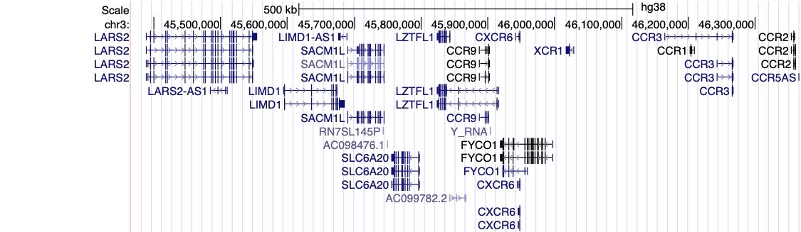

Rédigé en anglais par Brooke Wolford and Kumar Veerapen, traduit en français par Palwendé Romuald Boua, Guillaume Butler-Laporte, Marie-Julie Favé, Laurent Francioli, Audrey Lemaçon, Sophie Limou, et Isabelle Migeotte au nom de la COVID-19 HGI

<small>
<em>
<strong>Avertissements:</strong> Premièrement, veuillez noter qu’il s’agit de recherche en cours de progression. Bien que nous fassions déjà des découvertes, nous avons besoin de plus d'échantillons pour avoir une compréhension solide de la contribution génétique aux différentes complications de la COVID-19. Plus nous ajouterons d'échantillons à notre étude, plus nous serons convaincus que les associations que nous observons existent et sont représentatives à travers les différents groupes de patients. Deuxièmement, nous ne sommes pas non plus en mesure d’estimer votre probabilité d'avoir une manifestation sévère de la COVID-19 sur la base de votre génétique. Les utilisateurs de nos résultats ne devraient pas utiliser nos découvertes à des fins de diagnostic pour les patients atteints de la COVID-19 sur la base de leur génotype et devraient toujours parler à un professionnel de la santé pour guider les choix médicaux. Enfin, si un vocabulaire ne vous est pas familier, veuillez nous envoyer un courriel à hgi-faq@icda.bio. Nous serons heureux de mettre à jour les informations ici pour plus de clarté. Dans les semaines à venir, des informations complémentaires expliquant les concepts ou la terminologie seront mises à disposition. En attendant, consultez <a href="https://medlineplus.gov/genetics/understanding/" target="_blank" rel="noopener noreferrer">cette</a> ressource pour passer en revue les bases de la génétique (en anglais, voir note en bas de page pour des ressources en français).
</em>
</small>

La pandémie de COVID-19 a affecté la vie quotidienne des sociétés du monde entier. Les scientifiques du monde entier travaillent d'arrache-pied pour mieux comprendre le virus et la maladie. Nous représentons l'un de ces groupes - la COVID-19 Host Genetics Initiative (HGI) (ou en français : Initiative pour la génétique de l’hôte de la COVID-19) - une équipe internationale de généticiens qui se concentre sur l'identification des variations génétiques humaines qui influencent les réponses à l'infection par le SRAS-CoV-2 et sa maladie subséquente, la COVID-19. En travaillant ensemble, nous sommes curieux de savoir quelles parties de l’ADN d’une personne peuvent influencer si une personne développe la COVID-19 et le cas échéant, la sévérité de la maladie.

## Le plan d’étude de la COVID-19 HGI

Dans notre étude, nous comparons les variations génétiques entre les cas, des personnes hospitalisées ayant également un test positif pour le SRAS-CoV-2, avec les contrôles qui sont des personnes de la population générale qui n'ont pas un test positif pour la COVID-19. Cette comparaison s'appelle une étude d'association pangénomique, ou GWAS (Genome-Wide Association Study). Regardez cette [vidéo](https://www.youtube.com/watch?v=cgyc55JhdcM) (en anglais, voir note en bas de page pour des ressources en français) ou cette [infographie](https://www.broadinstitute.org/visuals/explainer-genome-wide-association-studies) (en anglais, voir note en bas de page pour des ressources en français) pour une explication illustrée de ce que sont les GWAS ! En juillet 2020, nous avons combiné les résultats de huit études différentes pour un total de 3199 cas et 897488 contrôles.

<figcaption class="manual-md-inline-caption">
<strong>Figure 1: Résultats à partir du gel des données en juillet 2020.</strong> Les résultats présentés ci-dessus comparent les données génétiques entre 3,199 cas (patients hospitalisés à cause de la COVID-19) et 897,488 contrôles (échantillons de la population présumés négatifs pour la COVID-19).
</figcaption>

## Le consortium HGI a découvert une variation génétique associée à la gravité de la COVID-19

La figure 1 ci-dessus montre un résumé visuel des [résultats les plus récents](/results/) du consortium HGI. C'est ce qu'on appelle un graphique de Manhattan, veuillez consulter la note de bas de la page pour une description complète de cette visualisation. En bref, un graphique de Manhattan est utilisé pour visualiser les associations (force de l’association représentée sur l’axe des y; plus le point est haut, plus il est fortement associé au trait étudié) entre un trait (par exemple, la gravité de la COVID-19) et les variants génétiques sur l'ensemble du génome (situés le long de l’axe des x). Nous observons ci-dessus une région statistiquement significative (points situés au-dessus de la droite rouge) sur le chromosome 3 avec l’hospitalisation des patients en lien avec la COVID-19 (notez la ligne verticale en pointillé au-dessus du chromosome 3, comme indiqué sur l'axe horizontal des x). Parfois, comme ici, une région comprend plusieurs gènes proches les uns des autres. Des recherches supplémentaires sont alors nécessaires pour affiner la région statistiquement significative au(x) gène(s) spécifique(s) impliqué(s) dans la gravité de la COVID-19. La région identifiée sur le chromosome 3 chevauche plusieurs gènes (voir tous les noms de gènes répertoriés dans la figure 2), et le gène spécifiquement associé à la gravité de la COVID-19 dans cette étroite région demeure incertain. Cependant, nous avons des pistes intéressantes ! Il existe en effet plusieurs gènes liés aux chimiokines dans cette région, tels que CXCR6 et CCR1, qui contrôlent le déplacement des cellules immunitaires, notamment sur les sites infectieux et sont essentiels au bon fonctionnement du système immunitaire inné. Le gène SLC6A20 est également dans cette région, et est responsable de la synthèse d’une protéine connue pour se lier à ACE2, la protéine servant de porte d’entrée au virus SARS-CoV-2 à l’intérieur de nos cellules (Figure 3). Cela signifie qu'il est possible qu'une variation génétique de SLC6A20 influence l'entrée virale dans les cellules ! Cependant, ces découvertes d'associations génétiques ne sont que la première étape du processus de recherche.

<figcaption class="manual-md-inline-caption">
<strong>Figure 2: Visualisation à partir du navigateur génome <a href="https://genome.ucsc.edu" target="_blank" rel="noopener noreferrer">UCSC</a>.</strong> La piste sur cette figure montre les gènes (par exemple, CXCR6, SLC6A20, CCR1) dans notre région d'intérêt sur le chromosome 3.
</figcaption>

<figcaption class="manual-md-inline-caption">
<strong>Figure 3: Illustration du récepteur ACE-2.</strong> Ce schéma illustre l’interaction du récepteur ACE-2 d’une cellule hôte avec le virus SARS-CoV-2. Cette figure est adaptée de  <a href="https://www.rndsystems.com/resources/articles/ace-2-sars-receptor-identified" target="_blank" rel="noopener noreferrer">https://www.rndsystems.com/resources/articles/ace-2-sars-receptor-identified</a>.
</figcaption>

## Comparaison de nos résultats avec ceux d’autres études

[Les médias](https://www.cnn.com/2020/07/16/health/blood-types-coronavirus-wellness-scn/index.html) ont beaucoup parlé des études montrant une association entre le groupe sanguin et la COVID-19; le groupe A accroîtrait le risque et le groupe O le diminuerait. [Un article récent](https://www.nejm.org/doi/full/10.1056/NEJMoa2020283) du journal New England Journal of Medicine (NEJM) décrit une analyse des associations génétiques avec une forme sévère de la COVID-19 (p.ex. hospitalisation avec arrêt respiratoire) portant sur 1,980 individus d’origine italienne ou espagnole (ces résultats furent [répliqués par 23andMe](https://www.medrxiv.org/content/10.1101/2020.09.04.20188318v1)). Dans cette étude, le gène ABO sur le chromosome 9, qui détermine le groupe sanguin, est associé de manière significative avec la COVID-19. Toutefois cette étude utilise des donneurs de sang comme population contrôle, ce qui n’est pas idéal car les individus de groupe sanguin O tendent à être surreprésentés parmi les donneurs de sang. Nos données semblent confirmer cette suspicion: comme on peut le voir sur le graphique de Manhattan de la figure 1 ci-dessus, nous n’observons pas de résultat significatif (c.à.d. de points s’élevant au-dessus de la ligne rouge) sur le chromosome 9. Cela signifie que l’analyse de la COVID-19 HGI, qui inclut les données utilisées dans l’étude publiée dans le NEJM, ne soutient pas l’association avec le gène des groupes sanguins ABO à ce stade. Il nous faudra davantage de données pour clarifier à l’avenir si cette région est associée ou non à la COVID-19.

##  Les limites de nos résultats

Chaque étude scientifique a ses faiblesses et il est important de souligner certaines limites de nos analyses. Premièrement, puisqu’ils proviennent de données collectées au début de la pandémie (avant Juillet 2020), nos résultats sont préliminaires. Bien que notre échantillon soit déjà assez grand pour observer certaines associations, les prochains cycles d’analyses effectués sur des échantillons plus grands nous permettront d’obtenir des résultats plus robustes. Bien qu’un plus grand échantillon veuille malheureusement dire que la pandémie ne se soit pas atténuée, il permettra d’utiliser les résultats pour améliorer notre compréhension du lien entre le génome humain et la COVID-19.

Deuxièmement, ce qui constitue une forme sévère de la COVID-19 pourrait avoir été défini différemment d’une cohorte à l’autre, et les individus contrôles, présumés non-infectés, pourraient parfois avoir eu une infection asymptomatique, mais non diagnostiquée car non testée. Cependant, en augmentant la taille de l’échantillon, et donc la quantité de patients cas et d’individus contrôles, nous pouvons diminuer l’effet de ces sources de biais et d’incertitudes. Plus la taille de l’échantillon augmente, plus le risque d’observer une fausse association diminue (le biais “se dilue” dans la masse des données). Lorsqu’une association robuste est observée, nous pouvons alors nous concentrer sur celle-ci dans le cadre d’études à plus petite échelle, mais utilisant une méthodologie plus stricte. Nos résultats nécessitent donc plus de recherche pour mieux comprendre les mécanismes d’infection et de sévérité de la COVID-19.

## La suite des choses

Pour résoudre les problèmes énoncés ci-haut, nous continuons donc d’accepter l’inclusion de nouvelles cohortes participantes. Nous planifions d’effectuer le prochain cycle d’analyse à la fin septembre, et de rendre nos résultats publics en octobre 2020. Nous anticipons que la taille de notre échantillon augmentera d’environ 50%, et espérons ainsi améliorer considérablement notre compréhension de la COVID-19. Nous prévoyons aussi d’avoir accès à des données plus détaillées sur les symptômes des patients. Revenez visiter ce site en octobre !

A partir de ces données préliminaires, le travail de détective commence. Notre consortium et nos collaborateurs peuvent déjà effectuer des études additionnelles (bioinformatiques et de biologie fonctionnelle) pour mieux comprendre les mécanismes biologiques impliquant les gènes identifiés, et comment ils affectent la COVID-19. Une de ces études se concentrera d’ailleurs sur l’effet des variations génétiques sur les complications de la COVID-19 chez les patients hospitalisés souffrant d’une forme sévère de la maladie. Si vous désirez en savoir davantage sur ces études, suivez le lien [ici](/blog/2020-06-29-in-silico-follow-up-results/) (en anglais). Nous sommes heureux d’être en mesure d’étudier plus profondément les résultats de nos analyses génétiques dans le but d’améliorer la prise en charge des patients et de leur offrir de meilleurs traitements.

Pour en savoir plus sur la COVID-19 Host Genetics Initiative, vous pouvez consulter les articles de presse suivant (en anglais) :

[Washington Post](https://www.washingtonpost.com/opinions/2020/04/27/covid-19-quickly-kills-some-while-others-dont-show-symptoms-can-genetics-explain-this/)

[Vanity Fair](https://www.vanityfair.com/news/2020/04/genetic-chances-of-dying-from-coronavirus)

[NY Times](https://www.nytimes.com/2020/06/03/health/coronavirus-blood-type-genetics.html)

## Remerciements

Nous adressons nos remerciements à Rachel Liao, Caitlin Cooney, CGC, Karen Zusi, Andrea Ganna, Alina Chan, Sophie Limou, Shea Andrews et Jamal Nasir pour leurs contributions.

## Note de bas de page

Une figure de Manhattan (ainsi nommée d’après la ressemblance avec les tours de gratte-ciels de la ville de New York) est un outil très utilisé pour la visualisation des résultats des études d’associations génétiques. La ligne horizontale en abscisse illustre les positions des variations génétiques le long des 23 chromosomes (l’être humain possède 22 paires de chromosomes, plus la paire de chromosome XX ou XY en fonction du sexe).
La ligne verticale en ordonnée caractérise le niveau de significativité statistique appelé « p-value » dont la valeur est transformée en échelle logarithmique négative. Chaque point sur la figure illustre le niveau de significativité de l’association d’une variante génétique à une position particulière du chromosome (appelé polymorphisme de nucléotide unique (SNP) communément appelé « snip ») avec le caractère mesuré. Plus le point se situe haut sur l’axe des ordonnées, plus grande est sa probabilité d’être associé au caractère étudié (ex : sévérité de la COVID-19). Notre méthodologie est robuste, car à la différence de la plupart des études qui considèrent comme significative une p-value inférieure à 0,05  nous exigeons une p-value inférieure à 0,00000005 (indiquée par la ligne rouge sur la figure) pour améliorer la confiance en nos résultats. Lorsque le point est situé au-dessus de la ligne rouge, nous considérons l’association génétique « statistiquement significative » et pouvons par la suite concevoir des expériences supplémentaires pour comprendre les liens biologiques avec la variante génétique.

Ressources en français : [Bases de la génétique](https://genetique-medicale.fr/en-chiffres-et-en-images/), [Génomique et médecine personnalisée](https://www.youtube.com/watch?v=zsztvID6Onk&ab_channel=L%27EspritSorcierOfficiel), [GWAS](https://sciencesnaturelles.ch/topics/personalizedhealth/welche_methoden_werden_eingesetzt_/genetische_tests/gwas), [Hérédité et clonage](https://www.genomequebec-education-formations.com/education-concepts).
