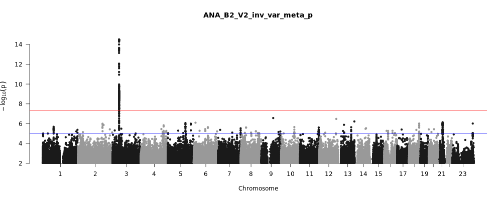
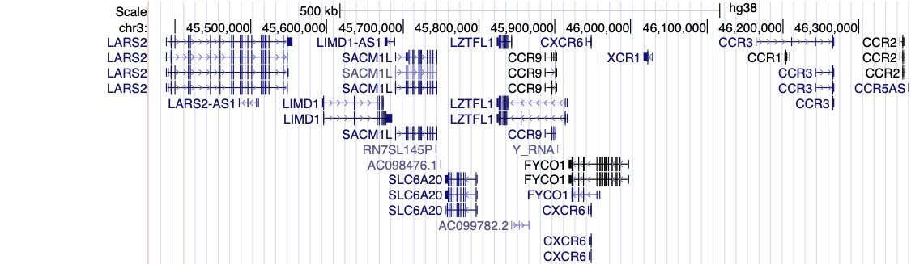
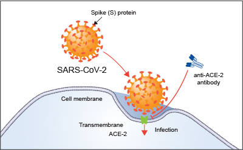

Напишано на Англиски од страна на Brooke Wolford и Kumar Veerapen (во име на COVID-19 HGI тимот), преводот на Македонски го изврши Билјана Атанасовска

<em>
<strong>Објаснување:</strong> Истражувањето е сеуште во тек. Покрај првичните сознанија, треба да напоменеме дека потребни се повеќе испитаници за подобро да разбереме како генетската компонента придонесува за развој на COVID-19. Колку повеќе испитаници се вклучуваат во нашата студија, толку посигурни можеме да бидеме дека резултатите се точни и репрезентативни во сите групи на пациенти. Понатаму, сеуште не можеме да кажеме која е веројатноста за поединец со познат генетски профил да развие посериозни симптоми на COVID-19. Во продолжение, доколку некои од термините ви се непознати, испратете ни е-пошта на <a href="hgi-faq@icda.bio" target="_blank" rel="noopener noreferrer">hgi-faq@icda.bio</a>– и ние ќе ги додадеме сите дополнителни информации за разјаснување на непознатите термини и концепти. Веќе работиме на ова поле и нови информации ќе бидат достапни во блиска иднина. Во меѓувреме, погледнете ги информациите кои се веќе објавени <a href="https://medlineplus.gov/genetics/understanding/" target="_blank" rel="noopener noreferrer">тука</a> кои ќе ви помогнат за подобро разбирање на основите на генетиката.
</em>
</small>

COVID-19 пандемијата има влијание врз секојдневниот живот на луѓето околу светот. Научниците од целиот свет напорно работат во насока на подобро разбирање на вирусот и болеста. Нашиот тим претставува токму таква група на научници –  COVID-19 Host Genetics Initiative (HGI) – и претставува интернационален тим на генетичари кои се занимаваат со идентификација на генетски варијации кои влијаат на начинот на кој човечкиот организам реагира на инфекција со SARS-CoV-2 вирусот, и последователно со болеста (COVID-19) која истиот ја предизвикува. Нашата цел е да истражиме дали некои делови од ДНК молекулата на луѓето влијаат на тоа дали истата индивидуа ќе развие COVID-19, и ако развие - до кој степен прогресира болеста.

## COVID-19 HGI дизајн на студијата

Студијата се базира на споредба на генетските варијации помеѓу случаи - луѓе кои се хоспитализирани и имаат позитивен тест за SARS-CoV-2 вирусот, со контроли – луѓе од општата популација кои немаат позитивен тест за COVID-19. Студиите кои опфаќаат ваква споредба се нарекуваат Геномски Асоцијативни Студии (Genome Wide Association Study – GWAS). За повеќе информации проверете го следното [видео](https://www.youtube.com/watch?v=cgyc55JhdcM) и [график](https://www.broadinstitute.org/visuals/explainer-genome-wide-association-studies), кои ќе ви дадат сликовито објаснување за GWAS. Започнувајќи од Јули 2020, успеавме да комбинираме резултати од осум различни студии, вклучувајќи 3,199 случаи и 897,488 контроли.

<figcaption class="manual-md-inline-caption">
<strong>Слика 1. Актуелни резултати од дата 3 (Јули 2020). </strong> Резултатите претставени погоре вклучуваат генетски анализи помеѓу 3,199 случаи (пациенти хоспитализирани поради COVID-19) и 897,488 контроли (луѓе од општата популација за кои се смета дека се COVID-19 негативни).
</figcaption>

## Генетски варијации асоцирани со COVID-19 во рамките на COVID-19 HGI студијата

Слика 1, горе, е визуелна репрезентација од најновите [резултати](/results/) од COVID-19 HGI студијата. Ова е таканаречен Менхетен график, за повеќе информации погледнете го целосното објаснување за оваа визуелна репрезентација во фуснотата подолу. На кратко, Менхетен графикот се користи со цел визуелно да се претстави асоцијација помеѓу одредена особина (на пр. COVID-19) и генетските варијации во целокупниот геном на човекот. Во оваа студија пронајдовме еден регион со сигнификантно значење лоциран на хромозом 3 (регионот е претставен со вертикална точкеста линија над хромозом 3, локацијата на хромозомите е означена на хоризонталната х-оска). Понекогаш се случува да еден ваков регион вклучува повеќе гени кои се поставени блиску еден до друг. Во ваков случај, потребни се дополнителни анализи за да се потврди кои од овие гени покажува статистички сигнификантна асоцијација со COVID-19. Регионот најден на хромозом 3 вклучува повеќе гени (листата на сите гени е назначена на слика 2). Сеуште не се знае со сигурност кои од овие гени е поврзан со COVID-19 и прогресивноста на болеста. Сепак, сметаме дека во оваа група има неколку гени кои се потенцијални кандидати! Постојат неколку гени кои кодираат хемокини, како на пример CXCR6 и CCR1. Хемокините играат улога во движењето на имуните клетки и се [критични за нормална функција на вродениот имун систем](https://www.ncbi.nlm.nih.gov/pmc/articles/PMC4448619/). Генот SLC6A20 е исто така лоциран во овој регион, и кодира протеин кој се врзува за ACE2. ACE2 протеинот игра улога на врата низ која SARS-CoV-2 вирусот влегува во клетката (Слика 3). Сето ова покажува дека е можно генетската варијација во SLC6A20 генот да влијае на начинот на кој вирусот влегува во клетката! Овие резултати се само прв чекор во истражувачкиот процес.

<figcaption class="manual-md-inline-caption">
<strong>Слика 2. Визуелизација на геномскиот регион (<a href="https://genome.ucsc.edu" target="_blank" rel="noopener noreferrer">UCSC Genome Browser</a>).</strong> На оваа слика се претставени гените (вклучувајќи ги CXCR6, SLC6A20, CCR1) во регионот од интерес лоциран на хромозом 3.
</figcaption>

<figcaption class="manual-md-inline-caption">
<strong>Слика 3. ACE-2 pецептор. </strong> Илустрацијата ја покажува функцијата на ACE-2 протеинот како рецептор во клетката – домаќин, претставувајќи медијатор во процесот на инфекција со SARS-CoV-2 вирусот. Сликата е адаптирана од <a href="https://www.rndsystems.com/resources/articles/ace-2-sars-receptor-identified" target="_blank" rel="noopener noreferrer">https://www.rndsystems.com/resources/articles/ace-2-sars-receptor-identified</a>.
</figcaption>

## Споредба на резултатите од нашата студија со резултати од други студии

Постојат [сознанија](https://edition.cnn.com/2020/07/16/health/blood-types-coronavirus-wellness-scn/index.html) дека крвната група е асоцирана со развојот на COVID-19: крвната група А корелира со висок ризик, додека крвната група О има заштитен ефект. Во еден [неодамнешен](https://www.nejm.org/doi/full/10.1056/NEJMoa2020283) научен труд објавен во New England Journal of Medicine (NEJM), претставени се резултати од генетска асоцијација со сериозноста на COVID-19 (на пр. хоспитализација со респираторни компликации), вклучувајќи 1,980 индивидуи од Италија и Шпанија (резултатите се [реплицирани од страна на 23andMe](https://www.medrxiv.org/content/10.1101/2020.09.04.20188318v1)). Во оваа студија, најдени се индикации дека генот за АБО крвните групи лоциран на хромозом 9 покажува сигнификантна асоцијација со COVID-19. Сепак, треба да се напомене дека контролната група од оваа студија вклучува индивидуи кои се донори на крв, кои претежно се индивидуи со О крвна група, така што оваа група можеби и не е најидеална контролна група за споредба. Согласно, оваа асоцијација не беше потврдена со нашите резултати: од Менхетен графикот на Слика 1 може да се забележи дека во нашите резултати не гледаме сигнификантен резултат (т.е. точки над црвената линија) над хромозом 9. Овие резултати покажуваат дека анализите од COVID-19 HGI проектот, кои ја вклучуваат датата од NEJM студијата, во оваа фаза не може да ја потврди асоцијацијата помеѓу АБО крвните групи и генот. Потребно е да се вклучат поголем број на испитаници за да се одреди со поголема сигурност дали овој ген е асоциран со COVID-19.

## Ограничувања во нашата студија

Земајќи во предвид дека не е возможно да се дизајнира совршена студија, би сакале да напоменеме некои важни ограничувања во нашето истражување. Најпрво, резултатите објавени погоре се прелиминарни и опфаќаат дата од Јули 2020. Иако имаме доволно испитаници за да донесеме првично мислење, поголем број на испитаници во иднина би донеле поверодостојни резултати и заклучоци. Поголем број испитаници значи дека, за жал, поголем број луѓе ќе добијат инфекција од вирусот, што ќе придонесе за подобро да се разбере врската помеѓу генетскиот фактор и болеста.

Второ, сериозноста на болеста варира од една индивидуа до друга. Понатаму, се смета дека контролната група се испитаници кои немаат COVID-19, но познато е дека постојат голем број на асимптоматски случаи, така што некои од овие “контроли” можеби и имаат COVID-19. Сепак, ограничувањата кои произлегуваат од дизајнот на студијата може да се надминат со зголемување на бројот на испитаници: колку повеќе испитаници се вклучени во анализите, толку е помал ризикот за детекција на лажно позитивен сигнал. Понатаму, со идентификација на позитивен сигнал, би можеле да се фокусираме на помали студии со поголема контрола врз групите на испитаници, со цел да се потврдат пронајдоците. За понатамошно подобро разбирање на врската помеѓу генетскиот фактор и механизмот кој стои позади развојот на болеста, потребни се дополнителни истражувања.

## Нашите следни чекори

Со цел да се најде решение за ограничувањата со бројот на испитаници, ние и понатаму прифаќаме приклучување на дополнителни студии кон нашата студија. Следните анализи ќе се работат на крајот од Септември и резултатите ќе се објават на почеток на Октомври 2020. Се надеваме дека со новите анализи ќе добиеме повеќе информации, и се надеваме дека бројот на испитаници ќе се зголеми за 50% во споредба со сегашната бројка. Исто така, се надеваме да добиеме подетални информации во однос на симптомите од COVID-19. Новите информации ќе бидат додадени на оваа страна, така што на истава страна ќе можете да проверите што научивме во Октомври 2020!

Користејќи ги првичните резултати, нашето истражување продолжува. Нашиот конзорциум, како и други научници, ќе продолжи со анализирање на дополнителни студии со цел за подобро да разбереме како овие гени влијаат на биолошките процеси во организмот, и последователно, како овие процеси се поврзани со COVID-19 болеста. Доколку сте заинтересирани за идните студии на оваа тема, проверете го следниов [линк](/blog/2020-06-29-in-silico-follow-up-results/). Во овие студии ќе се истражува како генетските варијанти се асоцирани со симптомите кај хоспитализирани пациенти кои се посериозно зафатени од болеста. Нашата цел е подобро да ги разбереме резултатите добиени од генетските анализи и се надеваме дека тоа ќе донесе подобра клиничка пракса кон пациентите со COVID-19 или за подобар третман на болеста.

## Дополнителни  извори

Доколку сакате да прочитате повеќе за COVID-19 Host Genetic Initiative, погледнете ги следните линкови.

[Washington Post](https://www.washingtonpost.com/opinions/2020/04/27/covid-19-quickly-kills-some-while-others-dont-show-symptoms-can-genetics-explain-this/)

[Vanity Fair](https://www.vanityfair.com/news/2020/04/genetic-chances-of-dying-from-coronavirus)

[NY Times](https://www.nytimes.com/2020/06/03/health/coronavirus-blood-type-genetics.html)

## Благодарност

Благодарност до Rachel Liao, Caitlin Cooney, CGC, Karen Zusi, Andrea Ganna, Alina Chan, Sophie Limou, Shea Andrews, и Jamal Nasir за сите коментари и ревизии.

## Фуснота

Менхетен график (соодветно именуван бидејќи пиковите наликуваат на хоризонтот во Њу Јорк), е график кој често се користи за визуелизација на резултати од GWAS студиите. Хоризонталната линија на х-оската (“Хромозом”) ја претставува позицијата на генетските варијанти во рамките на сите 23 хромозоми (човекот има 22 пара на хромозоми и комбинација од Х и Y половите хромозоми). Вертикалната линија или у-оската ја претставува вредноста за статистичка сигнификантност која се нарекува п-вредност, трансформирана во негативна логаритамска скала. Секоја точка на графикот ја покажува статистичката сигнификантност помеѓу генетската варијанта на дадена хромозомска позиција (наречена SNP) и одредена карактеристика на болеста одредена посебно за секоја индивидуа. Колку точката е повисоко поставена на вертикалната оска, толку поверојатно е дека дадениот SNP е асоциран со одредена карактеристика на болеста (на пр. со степенот на сериозност на COVID-19). Нашата методологија е стриктна: додека повеќе студии земаат во предвид сигнификантни резултати со п-вредност помала од 0.05, во нашите анализи поставивме п-вредност од 0.00000005 (претставена со црвена линија) за да бидеме по сигурни во нашите резултати. Доколку една точка се наоѓа над црвената линија, таа генетска асоцијација се зема како “статистички сигнификантна” и истата подлежи на понатамошни анализи и дизајнирање на дополнителни експерименти за валидирање и подобро разбирање на биолошкиот ефект на истата генетската варијанта.
