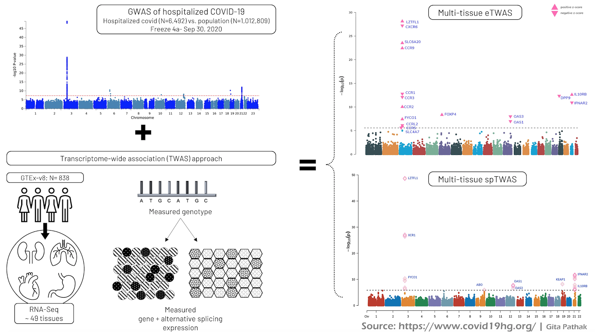

Written by Gita Pathak, PhD

Edited by Brooke Wolford, BS  & Kumar Veerapen, PhD

<small>
<em>
Note: This blog is intended for an audience of scientists and contains terminology specific to the field of genetics & genomics.

</em>
</small>

The emergence of SARS-CoV-2 has drastically impacted global health by resulting in millions of COVID-19 cases and deaths of more than 200,000 individuals. The wide-ranging symptoms observed in COVID-19 patients have led researchers to focus on the diversity of the human genome for clues that may explain the individual variability in response to COVID-19. As part of this effort, the COVID-19 Host Genetics Initiative (HGI), is collating studies from across the world with genotyped individuals with COVID-19 symptoms and their healthy counterparts.

## The COVID-19 Host Genetics Initiative and *in silico* follow up

The latest genome-wide association (GWAS) data released on September 30, 2020 (freeze 4 alpha) compared patients hospitalized due to COVID-19 (N=6,492) with  population controls presumed to be COVID-19 (N=1,012,809). This analysis highlighted genetic variants in six linkage disequilibrium (LD) independent genomic regions on chromosomes 3, 6, 12, 19, and 21. Despite this success, the proximal target genes at these regions responsible for mediating risk of COVID-19 severity is still unclear. To identify genes underlying COVID-19 hospitalization, we integrated GWAS results with population expression quantitative trait (eQTL) reference panels (e.g., GTEx) to perform a transcriptome-wide association study (TWAS). Briefly, TWAS tests for association between complex disease risk and gene expression levels predicted from nearby regulatory genetic variants. TWAS has been successfully applied to identify putative susceptibility genes underlying complex disease and has also been extended to predict other regulatory consequences of nearby genetic variants (e.g., alternative splicing). Please note, a large proportion of our hospitalized cases are from the Genetics of Mortality in Critical Care study ([GenOMICC](http://genomicc.org)), and their [medrxiv pre-print](https://www.medrxiv.org/content/10.1101/2020.09.24.20200048v2) reports a TWAS based on their GWAS.

## Results from TWAS analysis identifies genes on chromosomes 3, 6, 12, 19, and 21

Here we present preliminary results from our multi-tissue the expression-TWAS (eTWAS) and alternative  splicing TWAS (spTWAS) for COVID-19 hospitalization (**Figure 1, right panel**).

<figcaption class="manual-md-inline-caption">
<strong>Figure 1. COVID-19 TWAS and rationale.</strong> The <strong>top-left</strong> panel shows the GWAS of hospitalized COVID-19 results wherein each data point is a genetic variant, with association p-value (y-axis), and genomic coordinate grouped by chromosome (x-axis). The <strong>bottom-left</strong> panel shows the overview of TWAS approach using GTEx as the reference population, consisting of measured genotype, and gene and alternative splicing expression. On the <strong>top-right panel</strong> shows genes associated with COVID-19 hospitalization based on integration with gene expression data. Each data point is a gene, the genomic coordinate (x-axis), and most significant p-value (y-axis) across all tissues; the significant genes are labelled and their z-scores are shown as pink triangles. On the <strong>bottom-right</strong> panel, integration of alternative splicing shows associated splice sites (diamond shape) and corresponding gene name.
</figcaption>

Using reference expression from GTEx v8 (N=838), the eTWAS identified 17 genes on 5 chromosomes notably on

- chromosome 3: *LZTFL1*, *CXCR6*, *SLC6A20*, *CCR9*, *CCR1*, *CCR3*, *CCR2*, *FYCO1*, *CCRL2*, *CCR5*, *SLC4A7*;
- chromosome 6: *FOXP4*;
- chromosome 12: *OAS3* and *OAS1*,;
- chromosome 19: *DPP9*; and
- chromosome 21: *IL10RB* and *IFNAR2*.

The multi-tissue splicing TWAS (spTWAS) identified sites in *LZTFL1*, *XCR1*, *FYCO1*, *ABO*, *OAS1*, *OAS3*, *KEAP1*, *IFNAR2* and *IL10RB*.  Notably, *XCR1 ABO*, and *KEAP1* were genes specific to the predicted alternative splicing levels.

Subsequently, to identify biological processes, we performed pathway-analysis, which aggregates genome-wide genetic variants into genes while accounting for linkage disequilibrium. Three biological pathways identified were IFNA signaling, interferon-alpha-beta signaling and SLC-transporters.

It is important to note that the goal of the TWAS approach is neither to replicate position-based gene associations nor determine causality, but to highlight genes with evidence of genetically-regulated expression affecting disease susceptibility (here, COVID-19 induced hospitalization). The functional follow-up of prioritized targets in cell-lines and animal models would provide a granular resolution of the molecular mechanism of each identified gene target.

Overall, these findings highlight host variability in genes involved in cytokine and interferon signaling, and SLC-transporters. These findings could possibly explain the reported increase of cytokine levels in response to SARS-Cov-2 ([Valle et. al 2020](https://www.nature.com/articles/s41591-020-1051-9)). Interferon-mediated immune response is primarily observed in viral or bacterial infections ([Lin et. al 2014](https://www.sciencedirect.com/science/article/abs/pii/S135961011400077X?via%3Dihub)). The solute carriers (SLC) transporters are responsible for carrying different biological molecules throughout the cell ([Schumann et. al 2020](https://pharmrev.aspetjournals.org/content/72/1/343)) and some SLC-family genes are responsible for metabolic regulation of immune response ([Wojtal et. al 2014](https://journals.physiology.org/doi/full/10.1152/ajpgi.00353.2013)).

*NOTE*: For studies contributing to the final freeze 4 meta-analysis, please refer to the [RESULTS](/results/r4/) page. This data is currently unpublished and was presented at the COVID-19 HGI results update  meeting on October 2, 2020 (slides and presentation found [here](/blog/2020-10-05-october-2-2020-meeting/)). The results  will also be presented at the American Society of Human Genetics, Oct 28, 2020 as part of the [late breaking COVID-19 session](https://www.abstractsonline.com/pp8/#!/9070/session/336). The results will be published as part of the COVID-HGI TWAS working group efforts and will be made available on the medrxiv preprint server.

Contributing Studies - [https://www.covid19hg.org/acknowledgements/](/acknowledgements/)

1. Amsterdam UMC COVID study group

1. deCODE

1. Genetic determinants of COVID-19 complications in the Brazilian population

1. Genetic modifiers for COVID-19 related illness

1. GEN-COVID, reCOVID

1. FinnGen

1. Determining the Molecular Pathways and Genetic Predisposition of the Acute Inflammatory Process Caused by SARS-CoV-2

1. Genes & Health

1. COVID19-Host(a)ge

1. Penn Medicine Biobank

1. Qatar Genome Program

1. Biobanque Quebec COVID19

1. UK Biobank

1. Million Veteran Program

1. BOSCO

1. Ancestry

1. The genetic predisposition to severe COVID-19 - [Genomewide Association Study of Severe Covid-19 with Respiratory Failure](https://www.nejm.org/doi/full/10.1056/NEJMoa2020283)

1. genomiCC - [Genetic mechanisms of critical illness in Covid-19](https://www.medrxiv.org/content/10.1101/2020.09.24.20200048v2)
